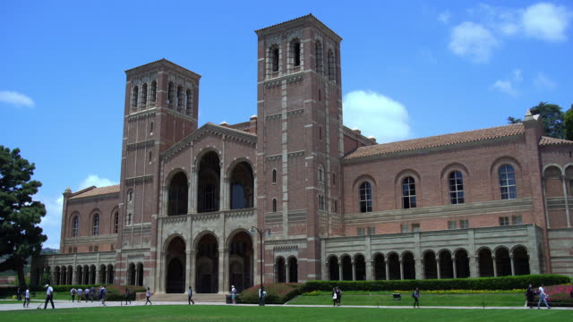

## Context
This dataset is created for prediction of Graduate Admissions from an Indian perspective.

<a href="https://www.gettyimages.com/videos/ucla?phrase=ucla&sort=mostpopular">Attribution to image site</a>

Note: This Dataset can be acquired through [Kaggle](https://www.kaggle.com/mohansacharya/graduate-admissions).
### Content
The dataset contains several parameters which are considered important during the application for Masters Programs.
The parameters included are :

- **GRE** score range is 130-170 for the main sections of Verbal Reasoning and Quantitative Reasoning.

- **TOEFL** test is scored on a scale of 0 to 120 points. Each of the four sections (Reading, Listening, Speaking, and Writing) receives a scaled score from 0 to 30.

- **University Rating** ( out of 5 )

- **SOP** & **LOR** - A Statement of Purpose is a sentence that you write, which states, in some detail, what you want to learn about in your research project. ( out of 5 )

- **Cumulative Grade Point Average (CGPA)** is the average of Grade Points obtained for all semesters and courses completed up to a given academic term, whereas the Grade Point Average (GPA) may only refer to one term. (out of 10)

- **Research** Experience ( either 0 or 1 )

- **Chance of Admit** ( ranging from 0 to 1 )

In this notebook, we're going to use values greater than or equal to 0.8 as the values of passing. 

**Acknowledgements**

This dataset is inspired by the UCLA Graduate Dataset. The test scores and GPA are in the older format.
The dataset is owned by Mohan S Acharya.

**Inspiration**

This dataset was built with the purpose of helping students in shortlisting universities with their profiles. The predicted output gives them a fair idea about their chances for a particular university.

**Citation**

Please cite the following if you are interested in using the dataset :
Mohan S Acharya, Asfia Armaan, Aneeta S Antony : A Comparison of Regression Models for Prediction of Graduate Admissions, IEEE International Conference on Computational Intelligence in Data Science 2019

I would like to thank all of you for contributing to this dataset through discussions and questions. I am in awe of the number of kernels built on this dataset. Some results and visualisations are fantastic and makes me a proud owner of the dataset. Keep em' coming! Thank You.
